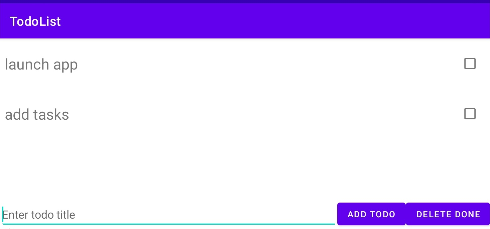
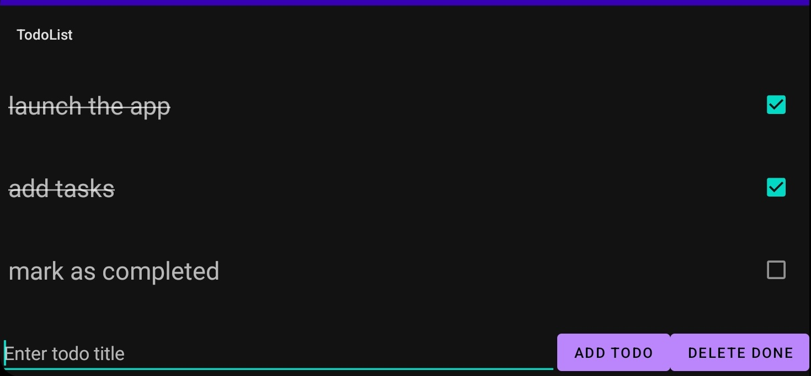

# Kotlin TodoList App
### Overview
This Kotlin-based mobile application is a simple TodoList app that allows users to create and organize tasks.

### Features
- Add Task
- Mark as Completed
- Delete Task
### Screenshots

